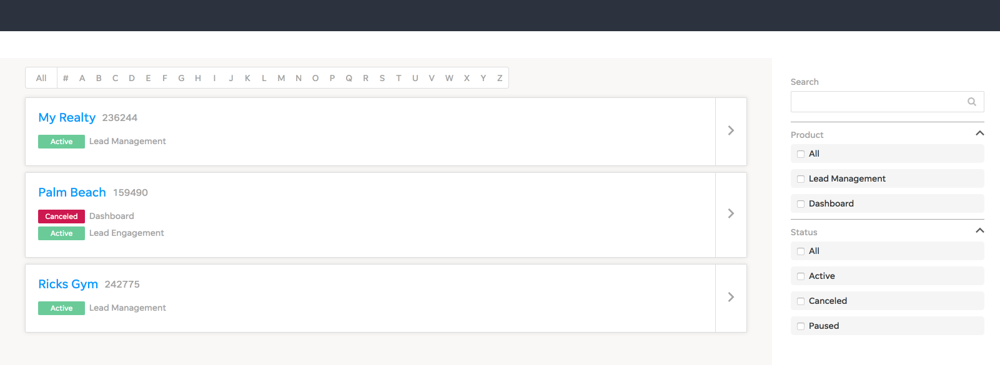

# Job Challenge
This was a old challenge for a gig.
I have migrated it from a old private repo and I problably wouldn't do it the same way today, but I like to keep it unchanged as a history of my progress.

## Task
Create a interface as close as possible from the image above based on a minimum project setup predefined beforehand:

## Features
1. Filter by client name using search field
2. Filter by product 
3. Filter by status
4. Filter by first letter
5. Interpolate all filters

### What was used
- Inherit the base project
    - React
    - SASS 
- To reflect the screenshot
    - Bootstrap 
    - react-collapsible
- To write tests
    - enzyme
### Challenges
1. Data may be inconsistent, such as missing products or wrong id fields
2. Dynamic filters on the sidebar
3. Integrate all filters
4. Use predefined structure and libs